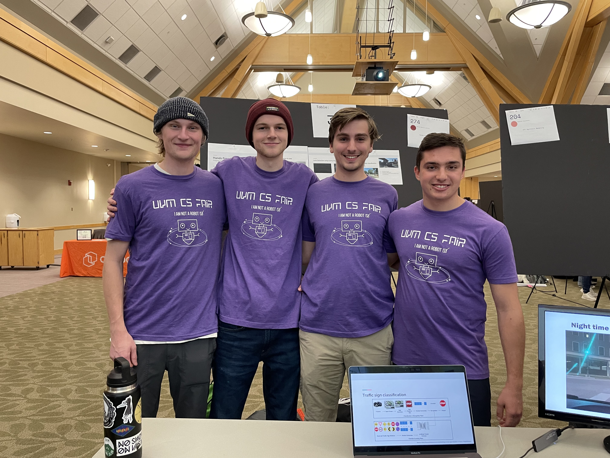

[![Contributors][contributors-shield]][contributors-url]
[![MIT License][license-shield]][license-url]

 

  

  <h3 align="center">Hands Free: Image Analysis</h3>

  

    Created by Shawn Rodgers, Dmytro Khursenko, David Smith, and Harrison Thompson</a>
     
     
  

<h2>About the Project</h2>

 

    </img>

 

For the final project in our Machine Learning class, we decided to work on software to analyze images taken by autonomous vehicles. Our goal was to annotate the images based on the results of various deep learning image processing algorithms. Since it was an introductory ML course, this was an ambitious project. We did not accomplish all that we had hoped, but I think we did very well with the time we had. 

Due to time restrictions, we decided to focus on three main ideas
* Object Detection
* Sign Classification
* Lane Detection

We wanted to detect and classify 10 classes of objects most frequently seen on the road (cars, traffic signs, pedestrians, etc). In the stills and the video demo found <a href="#demo">below</a>, red boxes identify objects that were successfully classified into one of 10 classes by our model running Faster-RCNN. Above the box is the label of the object, followed by the confidence of the model in its decision. If the object was classified as a traffic sign, it is then passed to a separate convolutional neural network (CNN) that attempts to further classify the type of traffic sign. If it is able to classify the type of traffic sign with a specified level of confidence, then the box is blue instead of red.

We learned that is quite difficult to perform accurate lane detection on most roads. There are numerous conditions such as fading lines and winding roads that lead to inconsistent results. Given more time we may have been able to find a stronger solution, but due to time restrictions, we were only able to get satisfactory results on the highway videos when running our lane detection algorithm.

 

    </img>

 

(<a href="#readme-top">back to top</a>)

<!-- USAGE EXAMPLES -->
## Demo

 

    

 

You can view a video demo of the project <a href="https://youtu.be/kuKiGpaKpwA" target="_blank">here</a>. We include in this video our analysis on two videos taken by us driving around downtown Burlington, as well as two videos provided by the Berkeley Deep Drive dataset.

In our demo we include
* A video taken in broad daylight with clear conditions
* A video taken at night with clear conditions
* A video taken during the day with rain and overcast
* A video taken on the highway with clear conditions (with lane detection)

(<a href="#readme-top">back to top</a>)

## CS Fair
We entered our project into the 2022 UVM CS Fair, and won first prize in the Advanced Machine Learning bracket! You can see the results of the fair <a href="https://csfair.w3.uvm.edu/" target="_blank">here</a>. (possibly <a href="https://csfair.w3.uvm.edu/2022" target="_blank">here</a> if the first link is broken.)

 

    

 

<!-- LICENSE -->
## License

Distributed under the MIT License. See `License.txt` for more information.

(<a href="#readme-top">back to top</a>)

<!-- CONTACT -->
## Contact

### Shawn

Mail - me@directedbyshawn.com

Website - [directedbyshawn.com](https://www.directedbyshawn.com)

LinkedIn - [linkedin.com/in/directedbyshawn](https://www.linkedin.com/in/directedbyshawn)

(<a href="#readme-top">back to top</a>)

<!-- ACKNOWLEDGMENTS -->
## Resources

Resources that made this project possible.
### Training data
* [Berkeley Deep Drive Dataset](https://deepdrive.berkeley.edu/)

### Dependencies
* [pillow](https://pypi.org/project/Pillow/)
* [numpy](https://numpy.org/)
* [matplotlib](https://matplotlib.org/)
* [progressbar](https://pypi.org/project/progressbar/)
* [opencv](https://pypi.org/project/opencv-python/)
* [torch](https://pypi.org/project/torch/)
* [scikit-learn](https://pypi.org/project/scikit-learn/)
* [detecto](https://pypi.org/project/detecto/)
* [keras](https://pypi.org/project/keras/)
* [imageio](https://pypi.org/project/imageio/)
* [tensorflow](https://www.tensorflow.org/)

(<a href="#readme-top">back to top</a>)

<!-- MARKDOWN LINKS & IMAGES -->
<!-- https://www.markdownguide.org/basic-syntax/#reference-style-links -->
[contributors-shield]: https://img.shields.io/github/contributors/directedbyshawn/Hands-Free.svg?style=for-the-badge
[contributors-url]: https://github.com/directedbyshawn/Hands-Free/graphs/contributors
[license-shield]: https://img.shields.io/github/license/othneildrew/Best-README-Template.svg?style=for-the-badge
[license-url]: https://github.com/directedbyshawn/Hands-Free/LICENSE.txt
[linkedin-shield]: https://img.shields.io/badge/-LinkedIn-black.svg?style=for-the-badge&logo=linkedin&colorB=555
[linkedin-url]: https://linkedin.com/in/directedbyshawn
